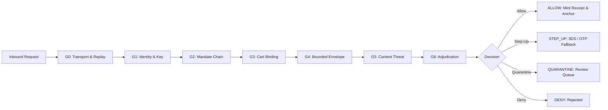
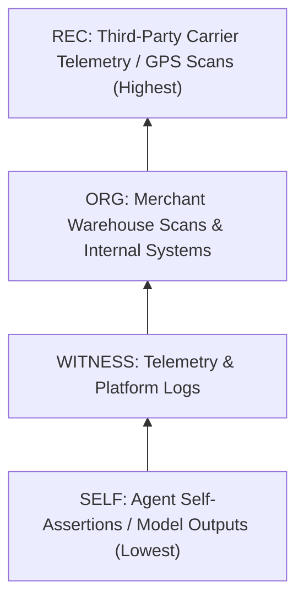

# Know-Your-Agent (KYA) 🛡️⚡

**An Obligation-Clearing Gateway and Autonomous Trust Mesh for Agentic Commerce on Razorpay Rails**

[](https://python.org)
[](https://fastapi.tiangolo.com)
[](tests/)
[](redteam/)
[](redteam/)
[](docs/02-architecture.md)
[](LICENSE)

> **"Identity says who called. A mandate says they were allowed.**  
> **Neither says the obligation was satisfied. KYA closes that loop."**

Razorpay AI Buildathon 2026 · **Track 01 — AI Growth & Agentic Commerce**

---

## 📑 Table of Contents

- [The Problem](#-the-problem)
  - [The Agentic Commerce Blindspot](#the-agentic-commerce-blindspot)
  - [The UPI Reserve Pay (SBMD) Dilemma](#the-upi-reserve-pay-sbmd-dilemma)
  - [The Inbound vs. Outbound Asymmetry](#the-inbound-vs-outbound-asymmetry)
- [What KYA Is](#-what-kya-is)
- [Core Design Principles](#-core-design-principles)
- [Architecture](#-architecture)
  - [Dual-Plane Architecture](#dual-plane-architecture)
  - [The 7-Gate Inline Pipeline (Data Plane)](#the-7-gate-inline-pipeline-data-plane)
  - [Obligation Ledger & Razorpay Anchoring](#obligation-ledger--razorpay-anchoring)
  - [The Control Plane & Poset Evidence Lattice](#the-control-plane--poset-evidence-lattice)
- [Empirical Red-Team Evaluation](#-empirical-red-team-evaluation)
  - [State of the Art Comparison (B0–B3)](#state-of-the-art-comparison-b0b3)
  - [Detection Quality Across 11 Attack Classes](#detection-quality-across-11-attack-classes)
  - [False-Positive Cost & Zero Lost Revenue](#false-positive-cost--zero-lost-revenue)
  - [Latency Profile](#latency-profile)
  - [Transparent Exception List](#transparent-exception-list)
- [Key Features & Ecosystem](#-key-features--ecosystem)
  - [Autonomous Sneaker Store & Buyer Simulation](#1-autonomous-sneaker-store--buyer-simulation)
  - [Model Context Protocol (MCP) Server](#2-model-context-protocol-mcp-server)
  - [Dispute Arbiter & Chargeback Dossiers](#3-dispute-arbiter--chargeback-dossiers)
  - [Cross-Rail Normalizer](#4-cross-rail-normalizer)
  - [AgentPay Autopilot Recovery Planner](#5-agentpay-autopilot-recovery-planner)
  - [Interactive Operations Dashboard](#6-interactive-operations-dashboard)
- [Project Directory Structure](#-project-directory-structure)
- [Getting Started](#-getting-started)
  - [Prerequisites](#prerequisites)
  - [Installation](#installation)
  - [Running the Test Suite](#running-the-test-suite)
  - [Running the Red-Team Benchmark](#running-the-red-team-benchmark)
  - [Running End-to-End Validation](#running-end-to-end-validation)
  - [Starting the API Gateway & Operator Dashboard](#starting-the-api-gateway--operator-dashboard)
  - [Starting the Modern React Frontend](#starting-the-modern-react-frontend)
  - [Connecting External AI Agents via MCP](#connecting-external-ai-agents-via-mcp)
  - [Verifying Live Razorpay Test Mode](#verifying-live-razorpay-test-mode)
- [API Reference & Reason Codes](#-api-reference--reason-codes)
  - [Core Endpoints](#core-endpoints)
  - [Reason Code Taxonomy](#reason-code-taxonomy)
- [Documentation Index](#-documentation-index)
- [Ethics & Responsible Disclosure](#-ethics--responsible-disclosure)
- [Academic & Industry References](#-academic--industry-references)

---

## ⚡ The Problem

### The Agentic Commerce Blindspot
AI agents (ChatGPT, Claude, Perplexity, autonomous procurement bots) are rapidly becoming primary commercial buyers. Existing and emerging standards answer two fundamental questions:
1. **"Is this agent who it claims to be?"** — Answered by [Visa Trusted Agent Protocol (TAP)](https://github.com/visa/trusted-agent-protocol) and [Cloudflare Web Bot Auth](https://blog.cloudflare.com/web-bot-auth/) via cryptographic signatures.
2. **"Was it authorized by a human principal?"** — Answered by [Google AP2](https://ap2-protocol.org/specification/) and [ACP](https://github.com/agentic-commerce-protocol/agentic-commerce-protocol) via client-side delegation mandates.

**Neither standard answers the third, decisive question:**
> **"Was the obligation the merchant took on actually satisfied?"**

As formulated in the seminal RAILS paper ([arXiv:2606.08790](https://arxiv.org/html/2606.08790)):
$$\text{"Payment settles value transfer. Clearing settles obligation state."}$$
Payment simply transfers value. Clearing determines whether the promised goods were received within specifications, whether the return was counterfeit, and who bears liability. Prior to KYA, no production system implemented this clearing loop on payment rails.

---

### The UPI Reserve Pay (SBMD) Dilemma
On **UPI Reserve Pay**, built on NPCI’s Single Block Multi Debit (SBMD) architecture, this vulnerability is acute:
- A user signs an authorization block once.
- The merchant can subsequently debit multiple times without requiring fresh authentication for each charge.
- The boundary is bounded only by broad parameters: total amount, expiry window, and merchant scope.
- **Nothing binds an individual debit to an obligation actually incurred.**

Adversaries exploit this loop:
- **Refund Floods:** Bot farms generate thousands of automated return requests before physical delivery scans occur ([Unit 42: Retail Fraud in Agentic AI](https://unit42.paloaltonetworks.com/retail-fraud-agentic-ai/)).
- **Block Draining:** Subtly substituting cart SKU parameters or issuing multiple partial charges until a customer's pre-authorized funds are exhausted.

---

### The Inbound vs. Outbound Asymmetry
Razorpay Agent Studio offers excellent defenses—discount ceilings, human approval gates, review-first mode, and one-tap disables. However, **every one of these features governs an outbound agent** (an agent employed and configured by the merchant).

Merchants have **zero native governance over inbound agents**: third-party AI buyers running on unknown hardware, operated by external consumers, interacting programmatically with merchant APIs.

---

## 💡 What KYA Is

**Know-Your-Agent (KYA)** is a high-performance, merchant-side security gateway and clearing mesh positioned upstream of Razorpay Orders, Payments, and Refunds:

```
 Inbound AI Buyer Agent (ChatGPT, Claude, Custom Bot)
              │
              │  RFC 9421 HTTP Signatures + AP2 Mandate Bundle
              ▼
   ┌────────────────────────────────────────────────────────┐
   │                  KYA SECURITY GATEWAY                  │
   │                                                        │
   │  [1] Verifies Identity (RFC 9421 / Ed25519)            │
   │  [2] Validates Mandate Chain & Sublinear Bounds        │
   │  [3] Enforces Strict Cart Cryptographic Binding        │
   │  [4] Bounds Velocity & Protects Reserve Pay Blocks     │
   │  [5] Quarantines Injection & Callbacks                 │
   │  [6] Mints Tamper-Evident Obligation Receipts          │
   └───────────────┬────────────────────────┬───────────────┘
                   │                        │
                   ▼                        ▼
      Razorpay Payment Rails        Obligation Clearing Mesh
      - Orders API (`notes` anchor) - Graded Evidence Lattice
      - Payments & Refunds API      - Reversal & Representment
      - SBMD Reserve Pay Ledger     - Dynamic Trust Passport
```

1. **Verifies Inbound Agent Identity:** Strict RFC 9421 HTTP Message Signatures with Ed25519 keys, compatible with Visa TAP and Cloudflare Web Bot Auth.
2. **Validates Mandate Chains:** Verifies delegated buyer authority and enforces that the cart being charged is cryptographically identical to the cart authorized by the user.
3. **Enforces Bounded Envelopes:** Real-time velocity throttles, refund circuit breakers, and per-debit obligation verification on UPI Reserve Pay blocks.
4. **Mints & Anchors Obligation Receipts:** Prior to capture, mints a signed obligation receipt and embeds its SHA-256 digest into `order.notes.kya_obligation` in Razorpay.
5. **Clears Obligations with Graded Evidence:** Evaluates fulfillment using an evidence poset lattice (`SELF < WITNESS < ORG < REC`) and automatically initiates settlement reversals or dispute defense.
6. **Resolves Cold Start with a Trust Ladder:** Progresses agents through an automated reputation ladder (`T0 → T1 → T2 → T3`), ensuring legitimate new buyers are bounded rather than rejected.

---

## 🎯 Core Design Principles

| Principle | Technical Implementation |
|---|---|
| **No LLM Moves Money** | The inline critical path is 100% deterministic (poset math, regex, cryptography). LLMs are restricted strictly to the asynchronous control plane, where their outputs carry the lowest evidentiary weight (`SELF`-class) and cannot clear or dispute settlements alone. |
| **Fail-Closed on Evidence, Fail-Soft on Absence** | Invalid signatures or tampered carts trigger an immediate `DENY`. An unreachable remote key directory gracefully degrades to a human step-up (`STEP_UP`) rather than dropping sales. |
| **Strict Idempotency** | Duplicate requests return cached cryptographic decisions without re-evaluating or mutating rate limits. |
| **External Proof Anchoring** | The audit trail is committed into Razorpay's immutable order notes (`notes.kya_obligation`), allowing independent verification by auditors who do not trust our internal database. |
| **Zero Lost Revenue on False Positives** | False alarms result in human step-up or quarantine review, never outright lost revenue (measured ₹0 refused legitimate GMV). |
| **Committed Evaluation Integrity** | The red-team evaluation corpus is frozen with a committed SHA-256 checksum before any detector tuning. |

---

## 🏛️ Architecture

### Dual-Plane Architecture

KYA partitions operations into an **ultra-fast inline Data Plane** and an **asynchronous Control Plane**:

```
AI Buyer Agent (Untrusted external LLM / Operator)
       │
       │ HTTP POST /v1/agent/orders (RFC 9421 + AP2 Mandates)
       ▼
╔═══════════════════════════════════════════════════════════════════════════════╗
║                             KYA GATEWAY                                       ║
║                                                                               ║
║  DATA PLANE (Inline, Pure Python / Crypto, 0 LLMs, p99 Budget < 50ms)        ║
║                                                                               ║
║   ┌─────────────┐   ┌─────────────┐   ┌─────────────┐   ┌─────────────┐      ║
║   │ G0 Replay   │──▶│ G1 Identity │──▶│ G2 Mandate  │──▶│ G3 Cart     │──┐   ║
║   │ Nonce + Time│   │ RFC 9421    │   │ AP2 Intent  │   │ Exact Digest│  │   ║
║   └─────────────┘   └─────────────┘   └─────────────┘   └─────────────┘  │   ║
║                                                                          │   ║
║   ┌─────────────┐   ┌─────────────┐   ┌─────────────┐                    │   ║
║   │ G6 Adjudicate│◀──│ G5 Threat   │◀──│ G4 Bounds   │◀───────────────────┘   ║
║   │ Truth Table │   │ Injections  │   │ Caps + SBMD │                        ║
║   └──────┬──────┘   └─────────────┘   └─────────────┘                        ║
║          │                                                                    ║
║          ▼ Result: ALLOW | STEP_UP | QUARANTINE | DENY                        ║
║                                                                               ║
║  OBLIGATION LEDGER (Tamper-evident, Append-Only Hash Chain)                   ║
║   - Mint Signed Obligation Receipt                                            ║
║   - Anchor `obligation_hash` into `order.notes.kya_obligation`                ║
╚══════════╤════════════════════════════════════════════════════════════════════╝
           │                                          │
           ▼ Real / Test-Mode API                     ▼ Real-time Updates
┌──────────────────────────────┐          ┌─────────────────────────────────────┐
│    RAZORPAY PAYMENT RAILS    │          │  CONTROL PLANE (Asynchronous)       │
│  - Orders API (Anchored)     │          │  - Evidence Ingestion & Normalizer  │
│  - Payments / Captures       │          │  - Poset Verification Mesh          │
│  - Refunds & Reversals       │          │  - Reconciler & Autopilot Planner   │
│  - Signed Webhooks           │          │  - Dispute Dossier Representment    │
│  - SBMD Reserve Pay Ledger   │          │  - Clearing Passport Trust Ladder   │
└──────────────────────────────┘          └─────────────────────────────────────┘
```

---

### The 7-Gate Inline Pipeline (Data Plane)

Every inbound purchase request traverses 7 sequential verification gates:



1. **G0 — Transport & Replay:** Validates RFC 9421 timestamp freshness ($\pm 300\text{s}$) and consumes cryptographic nonces using a pluggable, atomic limit store.
2. **G1 — Identity:** Cryptographically verifies Ed25519 signatures across signed headers and body digests. Queries public keys from a local stale-while-revalidate key cache.
3. **G2 — Mandate Chain:** Parses the AP2 intent and cart delegation chain, ensuring the agent's authority has not expired or exceeded delegated scope.
4. **G3 — Cart Cryptographic Binding:** Calculates the canonical SHA-256 digest of line items, currency, unit prices, and merchant accounts. Blocks in-transit cart substitution attacks (`C002`).
5. **G4 — Bounded Envelope:** Evaluates the agent's Clearing Passport tier (`T0`–`T3`). Enforces hourly velocity caps, refund rate circuit breakers, and ensures Reserve Pay (SBMD) debits do not exceed blocked balances.
6. **G5 — Content Threat & Callbacks:** Inspects unstructured text fields for prompt injection markers and enforces strict hostname allowlists on fulfillment callback URLs.
7. **G6 — Adjudication Engine:** Combines individual gate flags using a deterministic truth table, emitting machine-readable reason codes (e.g., `['C002', 'M001']`) and latency telemetry.

---

### Obligation Ledger & Razorpay Anchoring

When a transaction is approved (`ALLOW`), KYA creates an append-only obligation receipt before payment capture:

```json
{
  "obligation_id": "obl_3b6a7d758c01",
  "agent_id": "agent_apex_runner_v2",
  "principal_ref": "user_shopper_09",
  "cart_hash": "e3b0c44298fc1c149afbf4c8996fb92427ae41e4649b934ca495991b7852b855",
  "amount_paise": 799900,
  "currency": "INR",
  "predicates": [
    {
      "type": "CARRIER_DELIVERY_CONFIRMATION",
      "required_evidence_class": "REC",
      "timeout_seconds": 604800
    }
  ],
  "status": "OPEN",
  "prev_receipt_hash": "32fa13bd11bef917a02f4b070bfe5331fe842f61b252dbb0399c5bef00c85c41"
}
```

KYA calculates the SHA-256 hash of this receipt and embeds it into Razorpay's native order metadata:

```python
order = razorpay_client.order.create({
    "amount": 799900,
    "currency": "INR",
    "receipt": "rcpt_kya_001",
    "notes": {
        "kya_obligation": "sha256:e3b0c44298fc1c149afbf4c8996fb924...",
        "kya_agent_id": "agent_apex_runner_v2",
        "kya_version": "1.0"
    }
})
```

**Why this matters:**
- **Zero-Trust Verifiability:** An independent auditor or dispute analyst can fetch the order directly from Razorpay’s dashboard, hash the obligation receipt, and confirm that fulfillment terms were committed **before** payment was processed.
- **Tamper Evidence:** Any modification to the price, SKU, delivery terms, or return window invalidates the hash anchor.

---

### The Control Plane & Poset Evidence Lattice

Obligations cannot be cleared by arbitrary claims. KYA implements a strict **partially ordered set (Poset) evidence lattice**:

$$\text{SELF} \prec \text{WITNESS} \prec \text{ORG} \prec \text{REC}$$



- **`SELF` (Lowest):** Unverified agent claims or LLM evaluations. Inadmissible on its own to settle or dispute an obligation.
- **`WITNESS`:** Platform observations, access logs, and network telemetry.
- **`ORG`:** Merchant-signed internal state (e.g., warehouse dispatch scans, inventory logs).
- **`REC` (Highest):** Cryptographically signed third-party proofs (e.g., courier GPS tracking events, signed carrier delivery webhooks).

An obligation requiring `REC`-class evidence cannot be marked as satisfied by a `WITNESS` or `SELF` payload.

---

## 📊 Empirical Red-Team Evaluation

To ensure rigorous defense, KYA was evaluated against a frozen, hash-committed corpus of **530 sessions** (130 real attack scenarios across 11 classes, and 400 legitimate buyer sessions).

Evaluation integrity is enforced by an **anti-rigging protocol**: the runner verifies `CORPUS.sha256` (`e977fad495d83bed...`) and halts if any test scenario has been altered.

### State of the Art Comparison (B0–B3)

We compared KYA across four progressive defense postures:
- **B0 (None):** Baseline raw merchant endpoint without agent security.
- **B1 (Identity-Only):** Shipped State-of-the-Art (Visa TAP / Cloudflare Web Bot Auth).
- **B2 (Identity + Mandate):** SOTA with mandate token support (AP2).
- **B3 (Full KYA Gateway):** Complete KYA 7-Gate Data Plane and Obligation Ledger.

```
Attacks Blocked (out of 130 attacks):
B0 None          │ 0%
B1 Identity-Only █▍ 26% (34/130)  <-- Current Industry Shipped SOTA
B2 + Mandate     █████████▌ 56% (73/130)
B3 Full KYA      ██████████████████████████████ 95% (123/130)
```

| Defense Posture | Attacks Stopped | Recall | Precision | F1 Score | False-Positive Rate |
|---|:---:|:---:|:---:|:---:|:---:|
| **B0 No Gateway** | 0 / 130 | 0.0% | 100.0% | 0.00 | 0.0% |
| **B1 Identity-Only (Visa TAP)** | 34 / 130 | 26.2% | 100.0% | 0.41 | 0.0% |
| **B2 + Mandate (AP2)** | 73 / 130 | 56.2% | 100.0% | 0.72 | 0.0% |
| **B3 Full KYA** | **123 / 130** | **94.6%** | **100.0%** | **0.97** | **0.0%** |

---

### Detection Quality Across 11 Attack Classes

| # | Threat Class | B0 | B1 (TAP) | B2 (AP2) | B3 (KYA) | Catching Gate |
|---|---|:---:|:---:|:---:|:---:|---|
| **A1** | Agent Impersonation | ✗ | ✓ | ✓ | ✓ | **G1 Identity** |
| **A2** | Key Substitution | ✗ | ✓ | ✓ | ✓ | **G1 Identity** |
| **A3** | Signature & Nonce Replay | ✗ | ✓ | ✓ | ✓ | **G0 Replay** |
| **A4** | Mandate Substitution | ✗ | ✗ | ✓ | ✓ | **G2 Mandate** |
| **A5** | In-Transit Price / Cart Tampering | ✗ | ✗ | ✓ | ✓ | **G3 Cart Binding** |
| **A6** | Scope & Spend Limit Escalation | ✗ | ✗ | ✓ | ✓ | **G4 Envelope** |
| **A7** | Automated Refund Flooding | ✗ | ✗ | ✗ | ✓ | **G4 Envelope (Circuit Breaker)** |
| **A8** | Indirect Prompt Injection | ✗ | ✗ | ✗ | ~ | **G5 Content (Quarantine)** |
| **A9** | Counterfeit Webhook / Callback | ✗ | ✗ | ✗ | ✓ | **G5 Host Allowlist** |
| **A10**| Reserve Pay (SBMD) Block Drain | ✗ | ✗ | ✗ | ✓ | **G4 Reserve Guard** |
| **A11**| Obligation–Fulfilment Mismatch | ✗ | ✗ | ✗ | ~ | **Clearing Mesh (Post-Payment)** |

*Legend: ✓ All stopped · ~ Partial (documented exceptions) · ✗ Not stopped*

---

### False-Positive Cost & Zero Lost Revenue

A false positive in KYA does not result in lost merchant sales. The trust ladder steps suspicious transactions down to human 3DS/OTP verification or temporary quarantine:

| Defense Posture | Clean Allow | Denied (Lost Sales) | Stepped-Up (Friction) | Held for Review | Refused GMV |
|---|:---:|:---:|:---:|:---:|:---:|
| **B0 No Gateway** | 400 / 400 | 0 | ₹0 | 0 | **₹0** |
| **B1 Identity-Only** | 380 / 400 | 0 | ₹291,364 | 0 | **₹0** |
| **B2 + Mandate** | 380 / 400 | 0 | ₹291,364 | 0 | **₹0** |
| **B3 Full KYA** | 380 / 400 | 0 | ₹291,364 | 0 | **₹0** |

**Total Refused Legitimate Revenue across 400 sessions: ₹0.**

---

### Latency Profile

Measured over continuous evaluation on modern hardware:

| Metric | Measured Latency | SLA Budget | Margin |
|---|---|---|---|
| **p50** | **2.62 ms** | 10.0 ms | 73.8% under budget |
| **p95** | **6.04 ms** | 30.0 ms | 79.9% under budget |
| **p99** | **13.81 ms** | **50.0 ms** | **72.4% under budget** |

The inline data plane contains zero network calls or LLM invocations, ensuring consistent sub-15ms processing.

---

### Transparent Exception List

In the spirit of scientific transparency, KYA explicitly documents all 7 attacks from the 130-attack corpus that pass through B3:

| Session ID | Threat Class | Gateway Verdict | Root Cause & Design Justification |
|---|---|:---:|---|
| `a8-evasion-0000` to `0003` | **A8 Prompt Injection** | `ALLOW` | The injection consists of a fluent, natural-language paraphrase without instruction syntax markers. The deterministic G5 filter correctly passes it to avoid high false-positive rates on free-form checkout notes. The money path remains safe because line items and totals remain strictly bound by G3. |
| `a11-counterfeit-0000` to `0002` | **A11 Fulfillment Mismatch** | `ALLOW` | The delivered package matches all recorded delivery criteria (carrier tracking, weight, GPS). An LLM-based semantic evaluator flags the item as potentially counterfeit; however, under KYA's poset rules, model output is `SELF`-class evidence and cannot trigger an autonomous chargeback without human inspection. |

---

## ✨ Key Features & Ecosystem

### 1. Autonomous Sneaker Store & Buyer Simulation
Includes a realistic agentic commerce storefront (**Apex Kicks**) stocked with performance running shoes. Users can test autonomous AI buyer flows or direct human checkouts:
- Natural-language buyer prompts (e.g., *"Buy Puma Velocity Nitro 3 running shoes in size 10 under ₹8000"*).
- Instant mandate compilation, signature synthesis, and gateway adjudication.
- Real-time order creation and obligation receipt minting.

---

### 2. Model Context Protocol (MCP) Server
`shop_mcp.py` provides native **Model Context Protocol** integration, allowing tools like **Claude Code**, **ChatGPT Desktop**, and **Antigravity** to act as autonomous buyers on Razorpay rails:

```
External AI Agent (Claude Code / ChatGPT Desktop)
                    │
                    │ JSON-RPC over stdio (MCP Protocol)
                    ▼
          ┌─────────────────────┐
          │     shop_mcp.py     │
          │   FastMCP Server    │
          └──────────┬──────────┘
                     │
         ┌───────────┴───────────┐
         ▼                       ▼
    Product Discovery       KYA Gateway Order Execution
    `search_catalog`        `execute_order`
    `create_cart`           (Signed Mandate + Razorpay Rails)
```

Available MCP Tools:
- `search_catalog(query, max_price_inr)`: Search products by brand, keyword, and budget.
- `create_cart(sku, quantity, size)`: Generate cryptographically locked shopping carts.
- `execute_order(sku, max_budget_inr, quantity, size)`: Execute signed orders via KYA.
- `simulate_attack_scenario(scenario_id)`: Trigger red-team simulations directly from Claude/ChatGPT.

---

### 3. Dispute Arbiter & Chargeback Dossiers
Automates dispute preparation for merchant representment under **Visa Compelling Evidence 3.0 (CE3.0)** rules:
- **Cardholder Fraud (`10.4` / `4837`):** Generates an evidence dossier containing the agent’s Ed25519 mandate, IP telemetry, and anchored receipt.
- **Merchandise Not Received (`13.1` / `4853`):** Compiles carrier tracking timestamps, GPS coordinates, and delivery hashes.
- **Automated Fault Assignment:** Categorizes dispute liability across `BUYER`, `MERCHANT`, `CARRIER`, or `AGENT_OPERATOR`.

---

### 4. Cross-Rail Normalizer
Normalizes payment delegations across diverse rail architectures into canonical KYA mandate chains:
- **Stripe Shared Payment Tokens (SPT)**
- **Mastercard Agentic Commerce Tokens**
- **x402 HTTP Agent Pay Headers (USDC / Base)**
- **NPCI Unified Agent Protocol / UPI Reserve Pay**

---

### 5. AgentPay Autopilot Recovery Planner
Resolves synchronization errors between gateway decisions and Razorpay payment states without double charges:
- **Verified Capture:** Binds existing obligations to settled orders without re-initiating payment.
- **Unpaid Order:** Observes existing order IDs within a 60-second grace window.
- **Missing State:** Escalates stale ambiguous transactions to human operator review.

---

### 6. Interactive Operations Dashboard
A responsive web dashboard for real-time monitoring and administrative oversight:
- **Decision Stream:** Live feed of all incoming agent requests, reason codes, and gate latencies.
- **Dispute Center:** Visual breakdown of active chargebacks, liability distributions, and downloadable representment packages.
- **Quarantine Review Queue:** Interface for manual approvals or rejections of stepped-up requests.
- **Simulation Studio:** Single-click execution of legitimate transactions and A1–A11 attack vectors.
- **Live Metrics:** Real-time throughput, precision, recall, and ledger integrity tracking.

---

## 📂 Project Directory Structure

```
know-your-agent/
├── kya/                         # Core KYA Framework & Engine
│   ├── api/                     # FastAPI Application, State, & Operator Dashboard
│   │   ├── app.py               # REST API endpoints & route handlers
│   │   ├── state.py             # In-memory and persistent state manager
│   │   ├── templates/           # Jinja2 HTML server-rendered dashboard templates
│   │   └── static/              # CSS stylesheets, UI icons, and scripts
│   ├── clearing/                # Post-Payment Obligation Clearing Mesh
│   │   ├── evidence.py          # Graded evidence models & canonical hashing
│   │   ├── finality.py          # Finality state machine (PROVISIONAL -> FINAL)
│   │   ├── mesh.py              # Multi-verifier consensus mesh
│   │   ├── reversal.py          # Automated settlement reversal coordinator
│   │   └── service.py           # Core clearing management service
│   ├── disputes/                # Dispute Arbiter & Chargeback Defense
│   │   ├── arbiter.py           # Liability arbiter & fault attribution engine
│   │   ├── consent.py           # User consent audit trail ledger
│   │   └── representment.py     # Visa CE3.0 compliant chargeback dossier builder
│   ├── gates/                   # 7-Gate Inline Verification Data Plane
│   │   ├── g0_replay.py         # Timestamp window & nonce replay protection
│   │   ├── g1_identity.py       # RFC 9421 / Ed25519 cryptographic identity
│   │   ├── g2_mandate.py        # AP2 delegation chain validation
│   │   ├── g3_cart.py           # Canonical cart digest binding & drift checks
│   │   ├── g4_envelope.py       # Spend caps, circuit breakers, & SBMD guards
│   │   ├── g5_content.py        # Injection screening & callback allowlists
│   │   ├── g6_adjudicate.py     # Deterministic truth table & telemetry builder
│   │   └── pipeline.py          # Composite 7-gate execution pipeline
│   ├── obligation/              # Obligation Receipts & Cryptographic Ledger
│   │   ├── anchor.py            # Razorpay order.notes metadata anchor
│   │   ├── ledger.py            # Append-only hash-chained obligation ledger
│   │   ├── postgres.py          # Production Neon / PostgreSQL ledger adapter
│   │   └── receipt.py           # Obligation receipt minting & validation
│   ├── rails/                   # Payment Rails & Upstream Integrations
│   │   ├── razorpay_client.py   # Razorpay API client (Orders, Payments, Refunds)
│   │   ├── webhooks.py          # Cryptographically verified webhook receiver
│   │   ├── cross_rail.py        # Multi-rail normalizer (Stripe, MC, x402)
│   │   └── mcp_adapter.py       # MCP bridge & tool execution engine
│   ├── autopilot.py             # AgentPay automated state recovery planner
│   ├── directory.py             # Agent key directory with Stale-While-Revalidate
│   ├── limits.py                # Process-local & Redis-ready rate limit store
│   ├── passport.py              # Clearing Passport store & T0-T3 trust ladder
│   ├── reconcile.py             # Razorpay payment reconciler (zero double debits)
│   ├── reserve_pay.py           # Labelled UPI Reserve Pay (SBMD) simulator
│   ├── schemas.py               # Pydantic domain models & request envelopes
│   ├── store_agent.py           # Autonomous AI shopper prompt parser & buyer
│   └── store_catalog.py         # Apex Kicks e-commerce product catalog
├── frontend/                    # Modern React + Vite Operator Dashboard
│   ├── src/
│   │   ├── pages/               # Store, Simulation, Disputes, Decisions, Metrics
│   │   ├── components/          # Reusable UI components & navigation bars
│   │   └── api.ts               # Type-safe API client for backend
│   └── package.json             # Frontend dependencies & build configuration
├── redteam/                     # Empirical Evaluation & Attack Harness
│   ├── corpus.frozen.json       # 530-session evaluation corpus
│   ├── CORPUS.sha256            # Cryptographic SHA-256 commit hash of corpus
│   ├── harness.py               # Benchmark execution harness (B0–B3)
│   ├── metrics.py               # Precision, recall, F1, and latency calculations
│   ├── run.py                   # CLI entrypoint for evaluation runner
│   └── scenarios.py             # Attack definitions across 11 threat classes
├── tests/                       # Automated Test Suite (325 Passing Tests)
│   ├── test_attacks_day1.py     # Identity, replay, and mandate attack tests
│   ├── test_attacks_day2.py     # Velocity, refund flood, & SBMD drain tests
│   ├── test_disputes_liability.py # Dispute arbitration & representment tests
│   ├── test_evidence_lattice.py # Poset evidence laws & lattice tests
│   ├── test_gateway.py          # End-to-end gateway execution tests
│   ├── test_live_razorpay.py    # Integration tests against live Razorpay sandbox
│   └── ...                      # Comprehensive coverage for all modules
├── docs/                        # In-Depth Technical Documentation (01–08)
├── e2e_validate.py              # End-to-end integration verification script
├── shop_mcp.py                  # Standalone MCP server for Claude & ChatGPT
└── pyproject.toml               # Python project configuration & dependencies
```

---

## 🚀 Getting Started

### Prerequisites
- **Python 3.11+** installed on your system.
- **Node.js 18+** and **npm** (for the modern React frontend).
- *(Optional)* Razorpay Test-Mode API Keys (`rzp_test_...` and key secret).

---

### Installation

Clone the repository and install the development dependencies:

```bash
git clone https://github.com/SreeAditya-Dev/Know-Your-Agent.git
cd know-your-agent

# Install editable Python package with development extras
pip install -e ".[dev]"
```

---

### Running the Test Suite

Run the full automated test suite (325 tests covering all gates, poset lattice laws, and attacks):

```bash
pytest tests/ -q
```

*Note: Tests requiring live network access and active Razorpay credentials automatically skip if environment variables are omitted.*

---

### Running the Red-Team Benchmark

Verify the frozen corpus integrity and run the full 4-posture evaluation harness:

```bash
# 1. Verify that the corpus matches its committed SHA-256 hash
python -m redteam.run --verify

# 2. Run the full benchmark across B0, B1, B2, and B3
python -m redteam.run --all
```

---

### Running End-to-End Validation

Execute the end-to-end validation script to verify the in-process money path, HTTP routes, cart tampering defenses, and simulation endpoints:

```bash
python e2e_validate.py
```

---

### Starting the API Gateway & Operator Dashboard

Start the FastAPI gateway server:

```bash
uvicorn kya.api.app:app --host 127.0.0.1 --port 8331 --reload
```

Once running, access the following interfaces:
- **Server-Rendered Operator Dashboard:** [http://127.0.0.1:8331/dashboard](http://127.0.0.1:8331/dashboard)
- **Interactive Swagger API Docs:** [http://127.0.0.1:8331/docs](http://127.0.0.1:8331/docs)
- **System Health Endpoint:** [http://127.0.0.1:8331/v1/health](http://127.0.0.1:8331/v1/health)

---

### Starting the Modern React Frontend

For the full visual experience (Apex Kicks store, interactive attack simulations, dispute dossiers):

```bash
cd frontend
npm install
npm run dev
```

Open your browser to [http://localhost:5173](http://localhost:5173). The React application connects directly to the FastAPI gateway on port `8331`.

---

### Connecting External AI Agents via MCP

You can connect **Claude Code**, **ChatGPT Desktop**, or any MCP-compatible agent directly to KYA using FastMCP:

```bash
# Start the MCP server directly
python shop_mcp.py
```

**Claude Code Integration (`claude_desktop_config.json`):**
```json
{
  "mcpServers": {
    "kya-shop": {
      "command": "python",
      "args": ["D:/hackathon/Razorpay/know-your-agent/shop_mcp.py"],
      "env": {
        "PYTHONPATH": "D:/hackathon/Razorpay/know-your-agent"
      }
    }
  }
}
```

Now ask your agent:
> *"Search Apex Kicks for shoes under ₹10,000, create a cart for Puma Velocity Nitro 3, and purchase them."*

---

### Verifying Live Razorpay Test Mode

To verify that obligation receipts are anchored into **real Razorpay test-mode orders**:

1. Copy `.env.example` to `.env` and add your test credentials:
   ```bash
   cp .env.example .env
   ```
   ```ini
   RAZORPAY_KEY_ID=rzp_test_your_key_id
   RAZORPAY_KEY_SECRET=your_secret_key
   ```

2. Execute the live verification script:
   ```bash
   python -m kya.live_check
   ```

3. Run the dedicated live integration tests:
   ```bash
   pytest tests/test_live_razorpay.py -m live -v
   ```

The script will output the created Razorpay Order ID. You can open that order directly in your Razorpay Merchant Dashboard to view `notes.kya_obligation` cryptographically committed in Razorpay's database!

---

## 📡 API Reference & Reason Codes

### Core Endpoints

| Method | Endpoint | Description |
|---|---|---|
| `POST` | `/v1/agent/orders` | Primary checkout endpoint. Validates RFC 9421 signatures, enforces gates, creates Razorpay order, and mints obligation. |
| `POST` | `/v1/agent/inspect` | Read-only inspection endpoint. Runs G0–G6 without executing payments or mutating rate-limit state. |
| `GET` | `/v1/decisions` | Returns recent gateway decisions, latencies, and reason codes. |
| `GET` | `/v1/obligations/{id}` | Retrieves the obligation state, fulfillment history, and linked Razorpay order ID. |
| `POST` | `/v1/evidence` | Ingests fulfillment evidence (`REC`, `ORG`, `WITNESS`, `SELF`) to clear open obligations. |
| `POST` | `/v1/disputes/evaluate` | Evaluates chargeback claims and generates cryptographically signed representment dossiers. |
| `POST` | `/v1/simulation/run` | Runs pre-configured red-team attack scenarios (A1–A11) or legitimate test purchases. |
| `GET` | `/v1/benchmark` | Fetches frozen evaluation metrics across postures B0–B3. |
| `POST` | `/v1/store/agent-checkout`| Natural-language prompt checkout for autonomous buyer agents. |

---

### Reason Code Taxonomy

When KYA rejects or steps up a request, it returns deterministic, structured reason codes:

```
Txxx = Transport / Replay  │  Cxxx = Cart Integrity  │  Xxxx = Content & Injection
Ixxx = Agent Identity      │  Exxx = Envelope & Limits│  Lxxx = Dispute & Liability
Mxxx = Mandate Validation  │  Oxxx = Obligation State │
```

| Code | Meaning | Gate | Typical Action |
|---|---|:---:|:---:|
| `T001` | Nonce reused (Replay attack detected) | G0 | `DENY` |
| `T002` | Timestamp outside valid $\pm 300\text{s}$ freshness window | G0 | `DENY` |
| `I001` | Signature missing or malformed | G1 | `DENY` |
| `I002` | Cryptographic signature verification failed (Ed25519) | G1 | `DENY` |
| `I004` | Key directory unreachable (Degraded identity) | G1 | `STEP_UP` |
| `M001` | Mandate expired or not yet valid | G2 | `DENY` |
| `M002` | Mandate principal does not match request buyer | G2 | `DENY` |
| `C001` | Cart line-item price tampering detected | G3 | `DENY` |
| `C002` | In-transit cart substitution (Signed cart $\ne$ Charged cart) | G3 | `DENY` |
| `E001` | Hourly spend velocity exceeded for agent tier | G4 | `STEP_UP` |
| `E002` | Refund rate circuit breaker triggered | G4 | `QUARANTINE` |
| `E003` | Reserve Pay (SBMD) debit exceeds authorized blocked balance | G4 | `DENY` |
| `X001` | Prompt injection marker identified in unstructured notes | G5 | `QUARANTINE` |
| `X002` | Callback URL host not present in merchant allowlist | G5 | `DENY` |

---

## 📚 Documentation Index

For in-depth architectural specifications and analysis, refer to our comprehensive technical documentation:

| Document | Description |
|---|---|
| 📖 [01 — The Problem](docs/01-problem.md) | Detailed analysis of the agentic commerce gap, inbound vs. outbound asymmetry, and NPCI Reserve Pay risks. |
| 🏗️ [02 — Architecture](docs/02-architecture.md) | Deep dive into Data Plane vs. Control Plane, degradation policies, and latency budgets. |
| 🛡️ [03 — Threat Model](docs/03-threat-model.md) | Formal definitions of Attack Classes A1–A11, security boundaries, and gate allocations. |
| 📜 [04 — Obligation Clearing](docs/04-obligation-clearing.md) | Mathematical description of the Poset Evidence Lattice, receipt chaining, and reversal mechanics. |
| 📊 [05 — Evaluation](docs/05-evaluation.md) | Corpus generation methodology, anti-rigging protocol, and statistical results. |
| 🔌 [06 — API Specification](docs/06-api.md) | Full OpenAPI/REST schema details, webhook signature verification, and error payloads. |
| ⚖️ [07 — Limitations & Scope](docs/07-limitations.md) | Honest disclosure of simulation boundaries (Reserve Pay/UAP) and documented exceptions. |
| 🎯 [08 — Pitch Script](docs/08-pitch-script.md) | 3-minute hackathon pitch script and demonstration walkthrough. |
| ❓ [Technical Q&A Defense](question.md) | Architectural defense covering 10K RPS sharding, carrier breach revocations, and attack economics. |

---

## 🔒 Ethics & Responsible Disclosure

This project is developed strictly for **defensive security and transaction integrity**. All attack simulations in the red-team corpus run against local sandbox merchants or dedicated Razorpay test-mode credentials (`rzp_test_`). No weaponizable zero-day exploits or hostile payloads against live external commerce sites are published within this repository.

---

## 📖 Academic & Industry References

1. **RAILS Protocol Proposal:** *"Payment settles value transfer. Clearing settles obligation state."* ([arXiv:2606.08790](https://arxiv.org/html/2606.08790), Jun 2026).
2. **SoK: Security of Autonomous LLM Agents in Commerce:** ([arXiv:2604.15367](https://arxiv.org/pdf/2604.15367)).
3. **Visa Trusted Agent Protocol (TAP):** [github.com/visa/trusted-agent-protocol](https://github.com/visa/trusted-agent-protocol).
4. **Cloudflare Web Bot Auth:** [blog.cloudflare.com/web-bot-auth](https://blog.cloudflare.com/web-bot-auth/).
5. **Google AP2 (Agent Payment Protocol):** [ap2-protocol.org](https://ap2-protocol.org/specification/).
6. **Agentic Commerce Protocol (ACP):** [github.com/agentic-commerce-protocol/agentic-commerce-protocol](https://github.com/agentic-commerce-protocol/agentic-commerce-protocol).
7. **Palo Alto Networks Unit 42:** [Retail Fraud in the Age of Agentic AI](https://unit42.paloaltonetworks.com/retail-fraud-agentic-ai/).
8. **Razorpay UPI Reserve Pay:** [razorpay.com/blog/upi-reserve-pay](https://razorpay.com/blog/upi-reserve-pay/).
9. **Razorpay MCP Server:** [github.com/razorpay/razorpay-mcp-server](https://github.com/razorpay/razorpay-mcp-server).
10. **RFC 9421 (HTTP Message Signatures):** [datatracker.ietf.org/doc/html/rfc9421](https://datatracker.ietf.org/doc/html/rfc9421).

---

<div align="center">
  <sub>Built with ❤️ for the <b>Razorpay AI Buildathon 2026</b> · Securing the future of autonomous agentic commerce.</sub>
</div>
